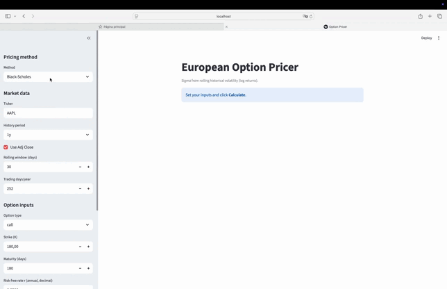

# projects

## European Option Pricing App
- Based on https://github.com/just-krivi/option-pricing-models
- App to price European call/put options with Black-Scholes using historical volatility from Yahoo Finance. Includes a Streamlit UI and a small CLI example.

## Churn Predictor Model
- Data from [Kaggle, Thomas Konstantin](https://www.kaggle.com/code/thomaskonstantin/bank-churn-data-exploration-and-churn-prediction)
 
TODO: add description and screenshot

## Credict Score Model
TODO: add description and screenshot

(for xgboos used un 02 Churn Predictor, if you are a MAC user you may need to install `brew install libomp`)

